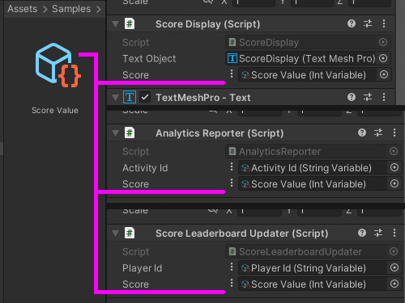
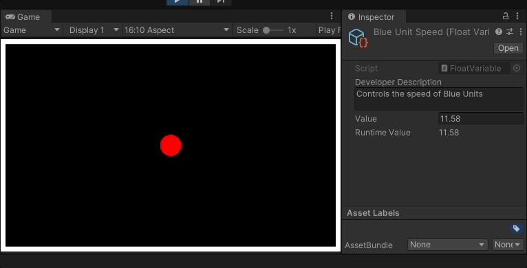
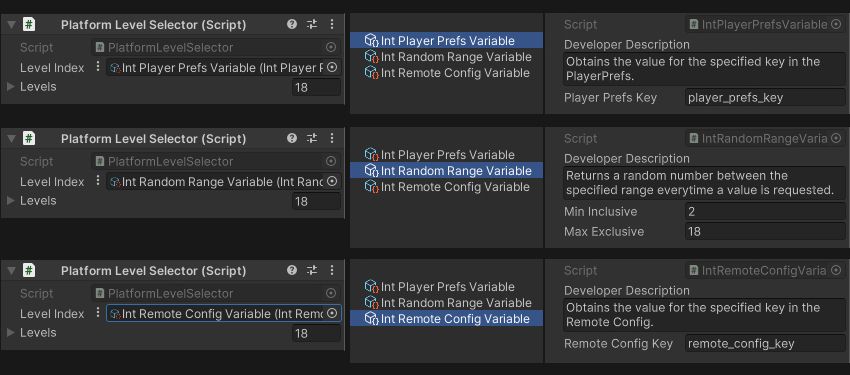

# MSD • Core • Variables

This module provides a modular variable system that utilizes `ScriptableObjects`.

## About

The architecture draws inspiration from Ryan Hipple's talk in Unite Austin 2017 titled "Game Architecture with Scriptable Objects" (video link below). While the usage sticks with the original design and implementation, this module focuses on making the architecture extensible. 

## Usage

### Single Source of Truth

Share data across different systems without creating unnecessary dependency.

Reference a single source of data and keep clients updated of changes in real time.

### Value as a Strategy

Keep the context independent of how the value is obtained. Extend, modify, or add new algorithms without changing the code of the context. 

## Installation

This is a custom package for Unity Package Manager.

* [Installing custom package from a Git URL](https://docs.unity3d.com/Manual/upm-ui-giturl.html)
* [Git dependencies](https://docs.unity3d.com/Manual/upm-git.html)
