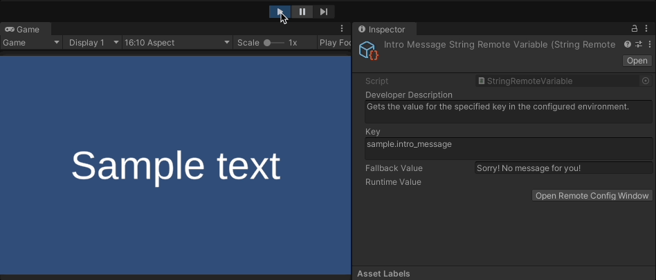

# MSD • Modules • Remote Variables

This module extends the [Core Variable Module](https://github.com/marcisd/com.marcisd.core.variables) to create `ScriptableObject` variables that get their value using [Unity's Remote Config service](https://unity.com/products/remote-config).

## Usage

Use the power of [Unity's Remote Config service](https://unity.com/products/remote-config) to update content in real-time without changing the code or rebuilding the app.

## Installation

This is a custom package for Unity Package Manager.

* [Installing custom package from a Git URL](https://docs.unity3d.com/Manual/upm-ui-giturl.html)
* [Git dependencies](https://docs.unity3d.com/Manual/upm-git.html)

### Setting-up Remote Config

[Learn How to Integrate Remote Config](https://docs.unity3d.com/Packages/com.unity.remote-config@3.3/manual/index.html)

### Setup

Open the `Remote Config Fetcher` from the menu `MSD/Config/Remote Config Fetcher`. The user will be presented with options for controlling the setup for the `Remote Config`.